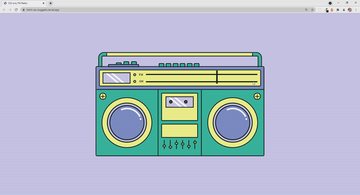

# CSS Only FM-Radio

When I was on [dev.to](https://dev.to/), I randomly saw [this](https://dev.to/aneeqakhan/animating-my-illustration-using-animate-css-1cm8) post which was about an illustration
made entirely with CSS. It was so nice and I decided to do the same illustration provided
by the author with pure HTML and CSS. 

## Original Illustration

## Illustration created using CSS

Ofcourse, I skipped some of the parts just because not to spend more time. You can preview the completed project [here](https://html-css-nuggets.vercel.app/).

